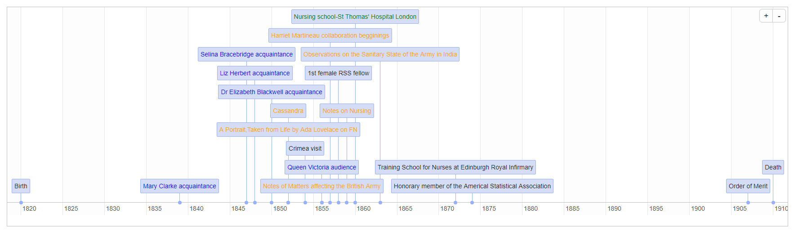

# Social Network Analysis - Florence Nightingale
Supplementary material complementing submitted article to Significance on the social networks of Florence Nightingale.

# Contributors
[Altea Lorenzo](https://github.com/altealo)

[Pilar Cacheiro](https://github.com/pilarcacheiro)

# Egonet
Interactive version: https://pilarcacheiro.github.io/SNA_FN/fn.egonet.html 

# Timeline

# References
Bibliographical references justifying, to the best of our knowledge, the connections between alters and ego (Florence Nightingale). 

Go to each of the alter's hyperlink to find the specific references connecting them to other alters.
| Alter  | Reference|
| ------------- |------------- |
| [Charles Babbage](https://github.com/altealo/CharlesBabbage/blob/master/README.md)  |[Collier, B. *The Little Engines that Could've: The Calculating Machines of Charles Babbage .*](http://robroy.dyndns.info/collier/)|
| [Elizabeth Blackwell](https://github.com/altealo/ElizabethBlackwell/blob/master/README.md)  |[Blackwell, E. *Pioneer work in opening the medical profession to women. .Autobiographical sketches.*](https://digital.library.upenn.edu/women/blackwell/pioneer/pioneer.html)|
| [Henry/Harry Bonham-Carter](https://github.com/altealo/HenryBonhamCarter/blob/master/README.md)  |[Records of the Nightingale Fund Council. *Letters from Henry Bonham-Carter to Florence Nightingale.*](https://discovery.nationalarchives.gov.uk/details/r/5ec02ca4-84c0-4d87-9ae3-872be4572b41)|
| [Hilary Bonham-Carter](https://github.com/altealo/HilaryBonhamCarter/blob/master/README.md) |[Bostridge, M. *Florence Nightingale: The woman and her legend.*](https://books.google.co.uk/books?id=OsCiBgAAQBAJ&lpg=PR334&pg=PP1#v=onepage&q&f=false)|
| [William Bowman](https://github.com/altealo/WilliamBowman/blob/master/README.md)  |[Cope, Z. *Miss Florence Nightingale and the doctors.*](https://journals.sagepub.com/doi/pdf/10.1177/003591575604901108)|
| [Charles Bracebridge](https://github.com/altealo/CharlesBracebridge/blob/master/README.md)  |[McDonald, L. *Florence Nightingale: An Introduction to Her Life and Family.*](https://books.google.co.uk/books?id=2dJ0CwAAQBAJ)|
| [Selina Bracebridge](https://github.com/altealo/SelinaBracebridge/blob/master/README.md)  |[McDonald, L. *Florence Nightingale: An Introduction to Her Life and Family.*](https://books.google.co.uk/books?id=2dJ0CwAAQBAJ)|
| [Edwin Chadwick](https://github.com/altealo/EdwinChadwick/blob/master/README.md)  |[Veysey, I. *A statistical campaign: Florence Nightingale and HarrietMartineau’s England and her Soldiers.*](http://journal.sciencemuseum.ac.uk/pdf/article/5620/a-statistical-campaign)|
| [Lady Charlotte Canning](https://github.com/altealo/LadyCharlotteCanning/blob/master/README.md)  |[Hourly History. *Florence Nightingale: A Life from Beginning to End.*](https://books.google.co.uk/books/about/Florence_Nightingale.html?id=L-hpswEACAAJ&redir_esc=y)|
| [Sir James Clark](https://github.com/altealo/JamesClark/blob/master/README.md)|[Hourly History. *Florence Nightingale: A Life from Beginning to End.*](https://books.google.co.uk/books/about/Florence_Nightingale.html?id=L-hpswEACAAJ&redir_esc=y)|
| [Arthur Hugh Clough](https://github.com/altealo/ArthurHughClough/blob/master/README.md)|[Bostridge, M. *Florence Nightingale: The woman and her legend.*](https://books.google.co.uk/books?id=OsCiBgAAQBAJ&lpg=PR334&pg=PP1#v=onepage&q&f=false)|
| [Charles Dickens](https://github.com/altealo/CharlesDickens/blob/master/README.md)|[Penner, L. *Victorian Medicine and Social Reform: Florence Nightingale among the Novelists.*](https://books.google.co.uk/books?id=5VDFAAAAQBAJ&pg=PA65&lpg=PA65&dq=Committee+of+the+Association+for+Improving+Workhouse+Infirmaries+nightingale+dickens&source=bl&ots=GnEuCljcyc&sig=ACfU3U3865rxKc7hFy5PHKfxsY1-IgfQXg&hl=en&sa=X&ved=2ahUKEwjl2evFl9LlAhVahlwKHZaNDx0Q6AEwA3oECAgQAQ#v=onepage&q=Committee%20of%20the%20Association%20for%20Improving%20Workhouse%20Infirmaries%20nightingale%20dickens&f=false)|
| [Mary Ann Evans/George Eliot](https://github.com/altealo/GeorgeEliot/blob/master/README.md)  |[McDonald, L. *Florence Nightingale: An Introduction to Her Life and Family.*](https://books.google.co.uk/books?id=2dJ0CwAAQBAJ)|
| [William Farr](https://github.com/altealo/WilliamFarr/blob/master/README.md)  |[Cook, E.T. *The Life of Florence Nightingale vol.1.*](http://www.gutenberg.org/files/40057/40057-h/40057-h.htm)|
| [Lady Galton/Marianne Nicholson](https://github.com/altealo/LadyGalton/blob/master/README.md)  |[The Newsroom. *Letters reveal another side to the Lady with the Lamp.*](https://www.yorkshireeveningpost.co.uk/news/letters-reveal-another-side-to-the-lady-with-the-lamp-1-7799998)|
| [Sir Francis Galton](https://github.com/altealo/SirFrancisGalton/blob/master/README.md)  |[McDonald, L. *Florence Nightingale and the early origins of evidence-based nursing.*](https://ebn.bmj.com/content/4/3/68)|
| [Elizabeth Gaskell](https://github.com/altealo/ElizabethGaskell/blob/master/README.md) |[Veysey, I. *A statistical campaign: Florence Nightingale and HarrietMartineau’s England and her Soldiers.*](http://journal.sciencemuseum.ac.uk/pdf/article/5620/a-statistical-campaign)|
| [Sidney Herbert](https://github.com/altealo/SidneyHerbert/blob/master/README.md)  |[McDonald, L. *Florence Nightingale: An Introduction to Her Life and Family.*](https://books.google.co.uk/books?id=2dJ0CwAAQBAJ)|
| [Liz Herbert](https://github.com/altealo/LizHerbert/blob/master/README.md) |[Bostridge, M. *Florence Nightingale: The woman and her legend.*](https://books.google.co.uk/books?id=OsCiBgAAQBAJ&lpg=PR334&pg=PP1#v=onepage&q&f=false)|
| [Dr Samuel Howe](https://github.com/altealo/SamuelHowe/blob/master/README.md)  |[*Florence Nightingale: Timeline.*](https://www.countryjoe.com/nightingale/tl1.htm)|
| [Benjamin Jowett](https://github.com/altealo/BenjaminJowett/blob/master/README.md)  |[Abbott, E. *The life and letters of Benjamin Jowett, M. A., master of Balliol college, Oxford.*](https://archive.org/details/lifelettersbenja01abboiala/page/n8)|
| [Ada Lovelace](https://github.com/altealo/AdaLovelace/blob/master/README.md)  |[Diamond, M. & Stone, M. *Nightingale on Quetelet.*](https://www.jstor.org/stable/2982160?seq=1#page_scan_tab_contents)|
| [John Macdonald](https://github.com/altealo/JohnMacdonald/blob/master/README.md)  |[Cook, E.T. *The Life of Florence Nightingale vol.1.*](http://www.gutenberg.org/files/40057/40057-h/40057-h.htm)|
| [Harriet Martineau](https://github.com/altealo/HarrietMartineau/blob/master/README.md)  |[Hill, M.R. & Hoecker-Drysdale, S. *Harriet Martineau: Theoretical and Methodological Perspectives.*](https://books.google.co.uk/books?id=Q5R9AwAAQBAJ)|
| [Sir John McNeill](https://github.com/altealo/SirJohnMcNeill/blob/master/README.md)  |[Cook, E.T. *The Life of Florence Nightingale vol.1.*](http://www.gutenberg.org/files/40057/40057-h/40057-h.htm)|
| [John Stuart Mill](https://github.com/altealo/JohnStuartMill/blob/master/README.md)  |[Mill, J.S. *The Later Letters of John Stuart Mill 1849-1873, Volumes 14-17.*](https://books.google.co.uk/books?id=E_PlDQAAQBAJ&pg=PT2311&lpg=PT2311&dq=helen+taylor+richard+monckton+milnes&source=bl&ots=iIPhObNWDR&sig=ACfU3U3FQxSrp_TZ3fPHg7qLuzoL0BnUcA&hl=en&sa=X&ved=2ahUKEwjOqL_FkI_mAhVHQkEAHfAVBjAQ6AEwAXoECAgQAQ#v=snippet&q=nightingale&f=false)|
| [Richard Milnes](https://github.com/altealo/RichardMilnes/blob/master/README.md)  |[Wemyss, T. *The life, letters, and friendships of Richard Monckton Milnes, first lord Houghton.*](https://archive.org/details/lifelettersandf09reidgoog)|
| [Julius Mohl](https://github.com/altealo/JuliusMohl/blob/master/README.md)  |[Florence Nightingale Letters. *Letter, Florence Nightingale to Julius Mohl.*](https://open.library.ubc.ca/collections/florence/items/1.0018076)|
| [Mary Clarke/Mohl](https://github.com/altealo/MaryClarke/blob/master/README.md)  |[Cook, E.T. *The Life of Florence Nightingale vol.2.*](https://www.gutenberg.org/files/40058/40058-h/40058-h.htm)|
| [Mary Clare Moore](https://github.com/altealo/MaryClareMoore/blob/master/README.md)|[Sullivan, M.C. *The Friendship of Florence Nightingale and Mary Clare Moore.*](https://books.google.co.uk/books?id=WUp7CgAAQBAJ&pg=PA93&lpg=PA93&dq=mary+clarke+and+arthur+clough&source=bl&ots=DbrNrB9NAx&sig=ACfU3U1wVlOc6u8WUy9A8YnjuNOzm-hHrA&hl=en&sa=X&ved=2ahUKEwj7p5fkxdnkAhVKdcAKHUd-DwMQ6AEwA3oECAUQAQ#v=onepage&q=mary%20clarke%20and%20arthur%20clough&f=false)|
| [Fanny Nightingale](https://github.com/altealo/FannyNightingale/blob/master/README.md)  |[Wikipedia. *Florence Nightingale.*](https://en.wikipedia.org/wiki/Florence_Nightingale#Early_life)|
| [William Nightingale](https://github.com/altealo/WilliamNightingale/blob/master/README.md)  |[Wikipedia. *Florence Nightingale.*](https://en.wikipedia.org/wiki/Florence_Nightingale#Early_life)|
| [Parthenope Nightingale](https://github.com/altealo/ParthenopeNightingale/blob/master/README.md) |[Wikipedia. *Florence Nightingale.*](https://en.wikipedia.org/wiki/Florence_Nightingale#Early_life)|
| [Lord Palmerston](https://github.com/altealo/LordPalmerston/blob/master/README.md)  |[Williams, K. *Reappraising Florence Nightingale .*](https://www.bmj.com/bmj/section-pdf/186089?path=/bmj/337/7684/Great_Britons.full.pdf)|
| [Lord Panmure](https://github.com/altealo/LordPanmure/blob/master/README.md)  |[Florence Nightingale Letters. *Letter, Panmure, Fox Maule, 2d Baron Panmure to Florence Nightingale.*](https://open.library.ubc.ca/collections/florence/items/1.0018159)|
| [Angelique Lucille Pringle](https://github.com/altealo/AngeliqueLucillePringle/blob/master/README.md)  |[Lorentzon, M & Brown, K. *Florence Nightingale as ‘mentor of matrons’: correspondence with Rachel Williams at St Mary's Hospital.*](https://onlinelibrary.wiley.com/doi/abs/10.1046/j.1365-2834.2003.00375.x)|
| [Adolphe Quetelet](https://github.com/altealo/AdolpheQuetelet/blob/master/README.md)  |[Diamond, M. & Stone, M. *Nightingale on Quetelet.*](https://www.jstor.org/stable/2982160?seq=1#page_scan_tab_contents)|
| [William Rathbone](https://github.com/altealo/WilliamRathbone/blob/master/README.md) |[Rathbone, E. *William Rathbone, a memoir.*](https://books.google.co.uk/books?id=xHINAwAAQBAJ)|
| [Henry Reeve](https://github.com/altealo/HenryReeve/blob/master/README.md)  |[Cook, E.T. *The Life of Florence Nightingale vol.1.*](http://www.gutenberg.org/files/40057/40057-h/40057-h.htm)|
| [Helen Richardson](https://github.com/altealo/HelenRichardson/blob/master/README.md)  |[Bostridge, M. *Florence Nightingale: The woman and her legend.*](https://books.google.co.uk/books?id=OsCiBgAAQBAJ&lpg=PR334&pg=PP1#v=onepage&q&f=false)|
| [Lord Shaftesbury/Ashley](https://github.com/altealo/LordShaftesbury/blob/master/README.md)  |[Vaughan Cole, B. *Florence Nightingale: One Woman’s Vision.*](http://files.lib.byu.edu/exhibits/nightingale/downloads/HouseofLearningLecture.pdf)|
| [Jane Smith](https://github.com/altealo/JaneSmith/blob/master/README.md)  |[McDonald, L. *Florence Nightingale: An Introduction to Her Life and Family.*](https://books.google.co.uk/books?id=2dJ0CwAAQBAJ)|
| [Julia Smith](https://github.com/altealo/JuliaSmith/blob/master/README.md)  |[Cook, E.T. *The Life of Florence Nightingale vol.1.*](http://www.gutenberg.org/files/40057/40057-h/40057-h.htm)|
| [Mai Smith](https://github.com/altealo/MaiSmith/blob/master/README.md)  |[Wikipedia. *Florence Nightingale.*](https://en.wikipedia.org/wiki/Florence_Nightingale#Early_life)|
| [Octavius Smith](https://github.com/altealo/OctaviusSmith/blob/master/README.md)  |[Cook, E.T. *The Life of Florence Nightingale vol.1.*](http://www.gutenberg.org/files/40057/40057-h/40057-h.htm)|
| [Patty Smith](https://github.com/altealo/PattySmith/blob/master/README.md)|[McDonald, L. *Florence Nightingale: An Introduction to Her Life and Family.*](https://books.google.co.uk/books?id=2dJ0CwAAQBAJ)|
| [Mary Somerville](https://github.com/altealo/MarySomerville/blob/master/README.md)  |[Somerville, M. *Personal recollections from early life to old age of Mary Somerville.*](https://archive.org/stream/bub_gb_aYWJ5nDuWSQC/bub_gb_aYWJ5nDuWSQC_djvu.txt)|
| [Alexis Soyer](https://github.com/altealo/AlexisSoyer/blob/master/README.md)  |[Soyer, A. *Soyer's culinary campaign : being historical reminiscences of the late war .*](https://archive.org/stream/soyersculinaryca00soyeuoft/soyersculinaryca00soyeuoft_djvu.txt)|
| [Sir Douglas Strutt Galton](https://github.com/altealo/SirDouglasStruttGalton/blob/master/README.md)  |[Kings collections. *Galton on the construction of hospitals.*](https://kingscollections.org/exhibitions/specialcollections/nightingale-and-hospital-design/galton-on-the-construction-of-hospitals)|
| [John Sutherland](https://github.com/altealo/JohnSutherland/blob/master/README.md)  |[McDonald, L. *Florence Nightingale: An Introduction to Her Life and Family.*](https://books.google.co.uk/books?id=2dJ0CwAAQBAJ)|
| [Helen Taylor](https://github.com/altealo/HelenTaylor/blob/master/README.md) |[McDonald, L. *Florence Nightingale on Society and Politics, Philosophy, Science, Education and Literature.*](https://books.google.co.uk/books?id=6uR0CwAAQBAJ&pg=PA370&lpg=PA370&dq=BENJAMIN+JOWETT+AND+EDWIN+CHADWICK&source=bl&ots=_oof-_UJK8&sig=ACfU3U3grpNzY5zaZmDD9H9DMq6yEDDWIw&hl=en&sa=X&ved=2ahUKEwihv-CUgPzjAhWQRRUIHUK_CTYQ6AEwDnoECAYQAQ#v=onepage&q=BENJAMIN%20JOWETT%20AND%20EDWIN%20CHADWICK&f=false)|
| [Sir Alexander Tulloch](https://github.com/altealo/SirAlexanderTulloch/blob/master/README.md)  |[Cook, E.T. *The Life of Florence Nightingale vol.1.*](http://www.gutenberg.org/files/40057/40057-h/40057-h.htm)|
| [Queen Victoria](https://github.com/altealo/QueebVictoria/blob/master/README.md)  |[McDonald, L. *Florence Nightingale: An Introduction to Her Life and Family.*](https://books.google.co.uk/books?id=2dJ0CwAAQBAJ)|
| [Julia Ward Howe](https://github.com/altealo/JuliaWardHowe/blob/master/README.md)  |[The History Blog. *Florence Nightingale’s Egyptian artifacts to go on display.*](http://www.thehistoryblog.com/archives/46973)|
| [Rachel Williams](https://github.com/altealo/RachelWilliams/blob/master/README.md)  |[Lorentzon, M & Brown, K. *Florence Nightingale as ‘mentor of matrons’: correspondence with Rachel Williams at St Mary's Hospital.*](https://onlinelibrary.wiley.com/doi/abs/10.1046/j.1365-2834.2003.00375.x)|
 

